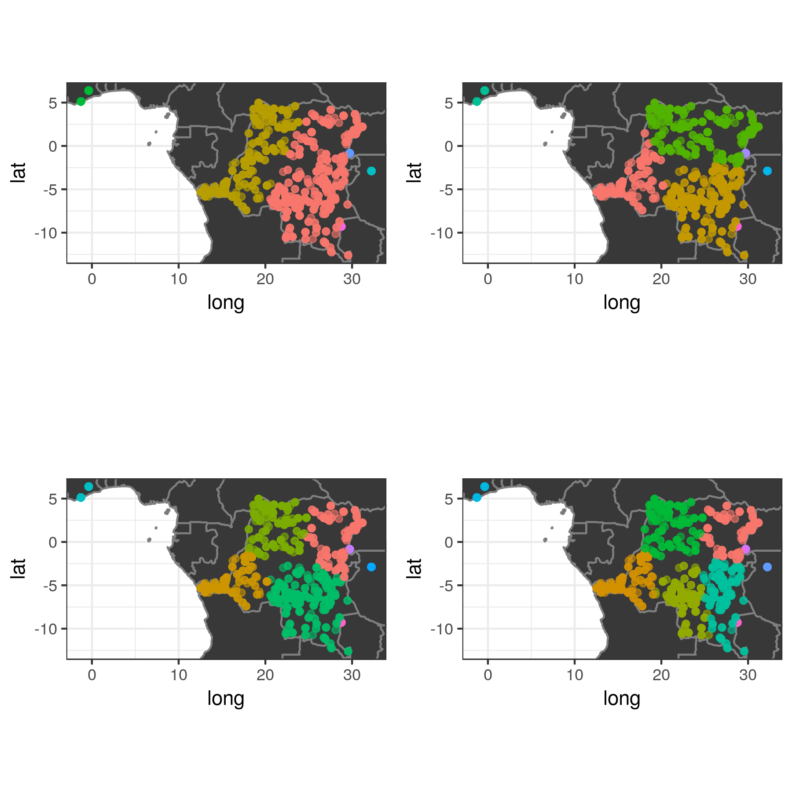
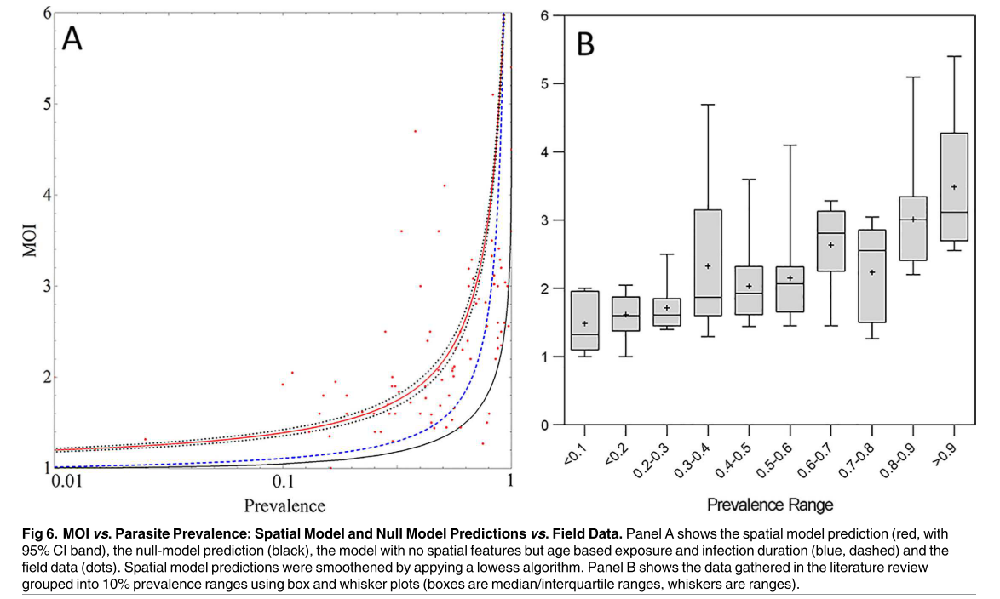

  
  
```{r setup, include=FALSE}
knitr::opts_chunk$set(echo = F, eval = T, warning = F, message = F)
```
```{r packages, echo=F, warning=F, message=F, results='hide'}
library(ggplot2)
library(tidyverse)
library(kableExtra)
```

# Methods

The filtered 1380 samples included MIP data on 1081 loci. The samples were clustered
geographically using k-means clustering with respect to the sample lat/lon locations, 
with 2, 3, 4 and 5 clusters specified for DRC. The REALMcCOIL (RMCL) categorical 
method was run on all loci initially within the geographic clusters, 
using 100,000 iterations and 1000 iteration burn in, and the MCMC chain thinned by 10%. 
Sequencing errors were estimated within the MCMC, with a maximum estimated COI equal to 25.
Sensitivity to the assumed threshold for calling a heteroxygote was also considered, with 
minor allele frequencies greater than 0.05, 0.1 or 0.15 assessed.

# Results

## Monoclonal Determination

The k-means clustering resulted in the clustering shown in the following splits.


```{r,fig.align='center'}
#map <- readRDS("plots/regions.rds")
#print(map)
#cowplot::plot_grid(plotlist = map)
```

For a given threshold for calling a sample a heterozygote, there was little variation in the estimated
COI for a given sample. For example, for a heterozygote threshold of 0.05 there were 11 samples that
were potentially estimated to be monoclonal, however depending on the number of clusters assumed in DRC
could have been dual-infections.

```{r,fig.align='center'}
mono_diffs <- readRDS("plots/monoclonal_changes.rds")
mono_diffs
```

Considering all heterozygote thresholds considered, 39 out of 1109 DRC samples were estimated to 
have differing COI estimates depedning on the assumed geographic substructure. The offending samples were
distributed broadly across the DRC:

```{r}
mono_discreps <- readRDS("plots/monoclonal_discrpancy_map.rds")
mono_discreps
```

To account for variation in the estimates of a samples' COI due to the geographic structure and the 
assumed heterozygote threshold, samples were assigned ratings of 1-5 to reflect the confidence in calling
a monoclonal based on RMCL. Overral, 455 out of 1380 samples were assured monoclonals, and a further 82
samples are probable monoclonals:

```{r}
monos <- readRDS("plots/monoclonal_summaries.rds")
monos %>% 
  knitr::kable()  %>% 
  kableExtra::kable_styling(bootstrap_options = "striped", full_width = F)
```

These have been passed to Nick for EHH.

## COI vs Transmission Intensity

The 1109 samples from DRC were selected to assess for patterns in the estimated COI. Each sample
was linked back to the original DHS cluster and survey weighted estimates for microscopy prevalence
and COI were calculated at the administrative level. 

```{r}
admin_coi <- readRDS("plots/admin_coi.rds")
admin_coi
```

Similarly, looked at this relationship at the cluster level.

```{r}
cluster_coi <- readRDS("plots/cluster_coi.rds")
cluster_coi
```

The realatiosnhip at the cluster level made me think of the following MOI/prevalence relationship 
from [Karl et al. 2016](https://journals.plos.org/plosone/article?id=10.1371/journal.pone.0164054), 
which is probably still the best systematic review of MOI against transmission intensity (for now...)




The data from the DRC does not look too dissimilar when grouped by prevalence range:

```{r}
prev_bin <- readRDS("plots/prev_bin.rds")
prev_bin
```

At this point, I thought it would be good to try and do some better modelling than just locally
weighted regressions. I may have gone off the rails a bit here, but based on the assumption that 
prevalence will impact COI I wanted to try and create some functional form for this relationship, 
so I used the Imperial model to first simulate the relationship between EIR and microscopy 
prevalence in children aged 0-5. For this relationship I looked at two functional relationships
relating EIR to prevalence that would be good candidates for the Imperial model relationship:

$$
Exponential: EIR = a.prev^b \\
Power: EIR = e^{a+b.prev}
$$

```{r}
imp_rel <- readRDS("plots/imper_model.rds")
imp_rel
```

These were used to fit linear mixed effects models with a random intercept for each administrative
region, weighted accroding to the survey weighted denominator for each cluster.

```{r}
rel <- readRDS("plots/coi_prev_plot.rds")
rel
```

Both models suggested a significant positive relationship between COI and prevalence, with the 
exponential model providing a slightly better fit. 

```
================================================
                        Dependent variable:     
                    ----------------------------
                                COI             
                        Power       Exponential
------------------------------------------------
Microscopy Prev       0.0002***      0.003***   
                      (0.00002)      (0.0003)   

Constant               1.792***      1.921***   
                       (0.093)        (0.083)   
                                                
------------------------------------------------
Observations             322            322     
Log Likelihood         -531.215      -529.153   
Akaike Inf. Crit.     1,070.430      1,066.305  
Bayesian Inf. Crit.   1,085.529      1,081.403  
================================================
Note:                *p<0.1; **p<0.05; ***p<0.01
```

Lastly, I did also try looking at the age of the individuals and the seasoanlity in the month 
prior to sample collection. However, both of these were not signficantly associated with COI 
and produced less well fitting models than without. Without their inclusion. the RSS for both
models were similar to those when using the loess regresion.

```{r}
mod_fits <- readRDS("plots/coi_prev_models.rds")
mod_fits
```

# Discussion


1. The number of monoclonals sent to Nick seems sensible and plausible and hopefully will help isolate
the EHH analysis. The sensitivity to the chosen heterozygote threshold largely did not affect the identification
of monoclonals. However, it did impact the estimated COI with more severe thresholds (MAF == 0.15) yielding
lower COI estimate. This did not, however, impact the relationships of COI compared to prevalence.
 
2. The relationship between COI and prevalence seems defensible to me, however, happy to be disagreed with. Also,
the fact the estimates of COI are generally lower than in the Karl paper seems correct, with the majority of 
DRC DHS samples collected from asymptomatic individuals. However, there were still some high COIs estimates, with
the range of COIs when using the lowest heterozygote threshold (MAF == 0.05) equal to 1-12. 

---
